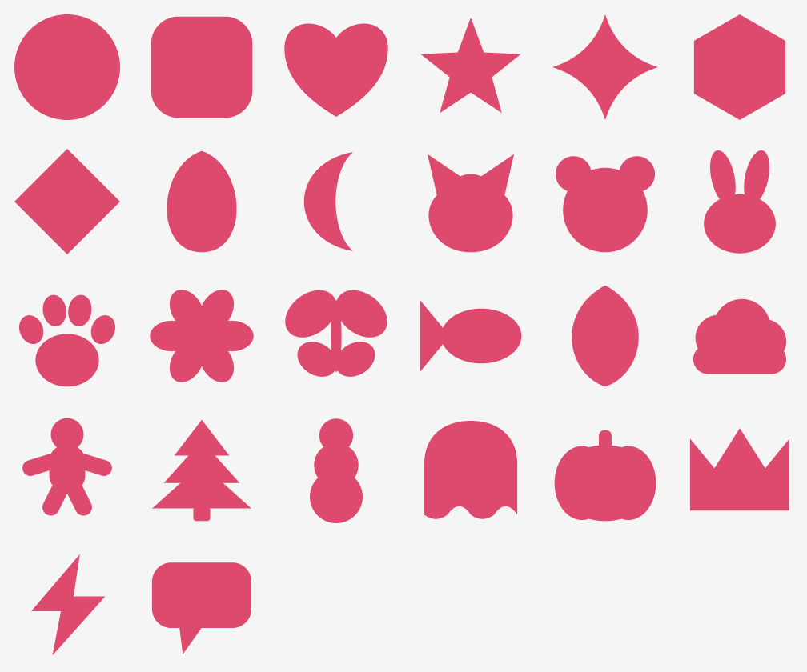

# 🍪 CookieCutter

A native iOS app for stamping stickers out of your photos with cookie cutter
shapes — and an **iMessage sticker pack** that serves them up in Messages.

```
   ★ pick a cutter        ✋ move the photo under it        ✂️ cut
   ┌───────────┐          ┌───────────┐                    ┌───────────┐
   │  ★ ♥ 🐱 🌲 │          │   ╱╲  ★   │                    │    ★      │
   │  ⬡ ☁ 👻 ⚡ │   ──▶    │  ╱  ╲     │        ──▶         │  (white   │
   └───────────┘          │ ╱____╲    │                    │   border) │
                          └───────────┘                    └───────────┘
```

- **26 cutters** — hearts, stars, cats, bunnies, paws, gingerbread people, fir
  trees, ghosts, pumpkins, clouds, crowns, lightning bolts…



<sup>Reference render of the outlines defined in `Models/CutterShape.swift`.</sup>
- **Pinch, drag and rotate** the photo under the cutter. What you frame is
  exactly what you get.
- **Die-cut sticker look** — an even white (or black/cream/pink/mint) border
  around the shape plus a drop shadow, drawn into a transparent PNG.
- **Stickers tab** — everything you've cut, ready to share, copy, drag out or
  save to Photos.
- **Messages extension** — your cuts appear in the Messages app drawer; tap to
  send, or drag one onto a bubble.

Everything happens on the device. There is no server and no account.

## Requirements

| | |
|---|---|
| Mac with **Xcode 16** or newer | to build it |
| iPhone or iPad on **iOS 17+** | to run it |
| Free Apple ID | to run it on your own device (7-day signing) |
| Paid Apple Developer Program ($99/yr) | only for TestFlight / the App Store |

The simulator works too, but Messages extensions are much easier to test on a
real device, and the camera button only appears where there is a camera.

## Run it

1. `open CookieCutter/CookieCutter.xcodeproj`
2. Select the **CookieCutter** scheme and your device.
3. Set your signing details — see below — then ⌘R.

### Signing and the App Group (do this once)

The project ships with placeholder identifiers. You need your own, because
bundle IDs and App Groups are globally unique:

1. **Both targets → Signing & Capabilities → Team**: pick your Apple ID team.
2. Change the two bundle identifiers to something of your own, keeping the
   extension nested under the app:
   - `CookieCutter` → `com.yourname.CookieCutter`
   - `CookieCutterStickers` → `com.yourname.CookieCutter.Stickers`
3. Change the **App Group** on both targets to `group.com.yourname.CookieCutter`
   (Signing & Capabilities → App Groups → +), and update the matching constant:

   ```swift
   // CookieCutter/Models/AppGroup.swift
   static let identifier = "group.com.yourname.CookieCutter"
   ```

That App Group is the only way the app and the Messages extension can see the
same files. If it isn't set up, **the app still works** — it falls back to its
own Documents folder — but the Messages drawer comes up empty, and the app says
so on the Stickers tab (ⓘ button).

### Using the stickers

- **Messages** — open a conversation, tap ⊕ next to the text field, choose
  CookieCutter. Tap a sticker to send it, or drag it onto a message bubble.
- **Anywhere else** — open a sticker and tap **Share** (WhatsApp, Mail, AirDrop,
  Files) or **Copy** and paste it into any chat. The transparency survives both.
- **Photos** — **Save to Photos** writes the transparent PNG to your library. On
  iOS 17+ you can then long-press the subject in Photos to lift it as a sticker
  there too.

## How it works

**Shapes are code, not images.** Every cutter is a `Path` described inside the
unit square, so the same definition draws a 44pt thumbnail and a 1024px export
(`Models/CutterShape.swift`). Composed shapes — the bear, the paw, the
gingerbread person — are built from primitives in `UnitPath.swift` and merged
with a real boolean union. Merely stacking the sub-paths would look right when
filled, but only by luck: sub-paths wound in opposite directions cancel out, and
stroking such a path draws the seams where the pieces overlap, which would put a
line across the bear's ears.

**The editor is WYSIWYG by construction.** The photo's position is never stored
in screen points: `PhotoTransform` keeps a zoom multiplier relative to an
aspect-fill baseline and an offset measured in fractions of the cutter frame.
`CutterEditorView` and `StickerRenderer` then apply the identical
translate → rotate → scale to a 320pt preview and a 1024px render.

**The border is stroked, not scaled.** `StickerRenderer` fills the silhouette
and strokes it with `2 × borderWidth` inside a transparency layer, so the border
grows evenly outwards and the shadow is cast once by the combined silhouette. A
scaled-down copy of the path — the obvious shortcut — would give a gingerbread
person fat legs and a thin head.

**Two processes, one folder.** The app writes `index.json` plus two PNGs per
sticker (full resolution for sharing, a downscaled copy that fits Messages'
500 KB limit) into the App Group container. `StickerStore` is compiled into both
targets; the extension only ever reads.

## Adding your own cutter

One entry in `CutterShapeLibrary`, and it shows up in the picker, the editor and
every export:

```swift
CutterShape(id: "acorn", name: "Acorn", category: .seasonal) {
    UnitPath.union([
        UnitPath.roundedRect(0.12, 0.06, 0.76, 0.30, radius: 0.12),  // cap
        UnitPath.ellipse(0.50, 0.60, 0.36, 0.38),                    // nut
    ])
}
```

Compose several pieces with `UnitPath.union([...])` and the primitives
`circle`, `ellipse`, `roundedRect`, `polygon`, `regularPolygon`, `star`, `capsule`,
or write a `Path` by hand with coordinates in 0...1. Keep it inside the unit
square; anything outside gets clipped by the export padding.

## Project layout

```
CookieCutter.xcodeproj          two targets: the app, and the Messages extension
project.yml                     the same project for XcodeGen, if you'd rather regenerate it
CookieCutter/
  CookieCutterApp.swift         @main
  Models/
    UnitPath.swift              path primitives in the unit square
    CutterShape.swift           the 26 cutters
    PhotoTransform.swift        photo placement + sticker style
    Sticker.swift               a saved sticker           (shared with the extension)
    AppGroup.swift              where stickers live       (shared with the extension)
    StickerStore.swift          read/write the library    (shared with the extension)
  Rendering/
    StickerRenderer.swift       photo + cutter -> transparent PNG
  Views/
    RootView.swift              Cutter / Stickers tabs
    CutterEditorView.swift      the cutting board and its gestures
    StyleSheet.swift            border thickness, colour, shadow
    StickerResultView.swift     "nice cut" + share/save/copy
    StickerLibraryView.swift    the grid, and how-to-use help
    StickerDetailView.swift     one sticker, with actions
    ShapeThumbnail.swift        one cutter in the picker strip
    Checkerboard.swift          transparency backdrop
  Support/
    PhotoSaver.swift            save to Photos
    ShareSheet.swift            UIActivityViewController
    CameraPicker.swift          UIImagePickerController
CookieCutterStickers/
  MessagesViewController.swift  the drawer inside Messages
  StickerBrowserViewController.swift
```

## Known gaps

- **The Messages extension has no icon yet.** It builds and runs, but shows a
  blank tile in the Messages drawer, and App Store validation will reject it
  until you add an `iMessage App Icon` image set to a `Stickers.xcassets` in the
  extension target. The app's own icon is included.
- **No iCloud sync** — stickers live on one device.
- **No subject cut-out.** iOS 17's `VNGenerateForegroundInstanceMaskRequest`
  could isolate the subject before the shape is applied; the cutter is
  deliberately dumb for now.
- The project is unbuilt on this machine (it was written on Linux, where no
  Swift toolchain or Xcode exists), so expect to fix the odd Xcode warning on
  first compile.
